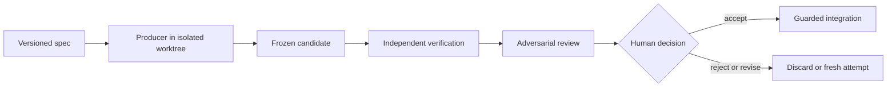

<p align="center">
  
</p>

<p align="center">
  <a href="#quick-start"></a>
  <a href="#direct-codex-cli"></a>
</p>

<p align="center">
  
  
  
  
</p>

**Verified coding-agent delegation for Claude Code.** Claude stays the architect and reviewer — it writes the spec, judges the evidence, and reports what landed. Implementation is delegated to fresh-context subagent implementers running on the coding CLI you choose — **Codex, OpenCode, Pi, or Pythinker** — each invocation starting clean with no inherited conversation state, inside an isolated Git worktree. The work comes back as a frozen, hash-anchored candidate that Claude reviews against independent verification evidence before a single byte can reach your checkout.

In practice that means three guarantees the plugin enforces in host code, not in prompts:

- **Isolation** — every Producer runs in a detached worktree with a sanitized environment, an explicit write allowlist, and OS sandboxing where certified. Out-of-scope changes are rejected at freeze time.
- **Evidence over claims** — a Producer saying "tests pass" is never accepted; the runtime reruns your authorized verification commands in a clean worktree and records the real output.
- **Separated authority** — implementers cannot approve their own work. Review, decision, and hash-gated integration are separate steps, and integration stages the reviewed tree without committing it. A verified candidate is accepted without prompting by default; anything less still requires a human ([decision authority](#decision-authority)).

## Status

> **Public beta:** Do not use Claude Architect unattended for production, destructive, or security-sensitive work. Review the complete candidate and verification evidence before integration.

The runtime and cross-platform lifecycle are evolving. Producer availability depends on the host OS, CLI version, authentication, requested lane, and proven execution capabilities.

## Why it exists

Delegating code generation is easy; establishing which exact bytes were produced, whether they stayed in scope, and whether anyone independent verified them is harder. Claude Architect keeps Claude focused on specification and judgment while treating external coding agents as untrusted Producers. It records a reproducible run, freezes a content-addressed candidate, verifies authorized checks in a clean materialization, and makes the human decision explicit.

## Core workflow



All agent output is an untrusted candidate, and implementers cannot approve their own work. A candidate that fails independent verification, or whose review gate refused it, can only be accepted by a human.

## Installation

Claude Code requires Node.js 22 or newer. Add the marketplace and install the plugin:

```bash
claude plugin marketplace add Pythoughts-labs/claude-architect
claude plugin install claude-architect@claude-architect
claude plugin list --json
```

Restart Claude Code after installing or updating. Install and authenticate at least one supported Producer CLI (`codex`, `opencode`, `pi`, or `pythinker`); Claude Architect reports unavailable lanes rather than silently substituting another agent.

## Quick start

Open Claude Code in a Git repository and name the Producer you want:

```text
/claude-architect:delegate Use Codex to add rate limiting to the public API, run the tests, and show me the independently reviewed candidate before integration.
```

If no Producer is named, the skill asks you to choose Codex, OpenCode, Pi, or Pythinker. Pi, OpenCode, and Pythinker are harnesses that accept optional model and thinking/variant overrides; model selection within a harness lane is optional and otherwise defers to that CLI's configured default. For non-trivial work it uses the fresh-context review pipeline. Read the exact patch, findings, and verification output before deciding whether to accept.

### Direct Codex CLI

The direct, unverified Codex CLI lane runs `codex exec` against your current checkout without an isolated worktree, frozen Candidate Artifact, or independent verification:

```text
/claude-architect:codex Review this checkout with gpt-5.6-sol at high reasoning.
```

Use it for direct Codex assistance when those controls are not required. Use `/claude-architect:delegate` when changes need the verified lane and its isolated worktree, frozen Candidate Artifact, independent verification, and guarded integration.

### Superpowers skill boundary

Claude Architect can use host-side Superpowers skills such as brainstorming, writing plans, and executing plans to shape and coordinate a delegation. Producers do not inherit that host skill set. Each edit attempt is offered only the three task-scoped procedures compatible with the trust model:

- `test-driven-development` for behavior changes and bug fixes;
- `systematic-debugging` for unexpected test, build, or behavior failures;
- `verification-before-completion` before a Producer claims success.

This filtered subset is vendored from [obra/superpowers](https://github.com/obra/superpowers) version 6.2.0 under the MIT license so it remains available inside an isolated attempt. Skills that assume nested delegation, self-review, branch acceptance, or an interactive human remain unavailable to Producers; the architect and human retain those authorities.

### Lanes as native subagents

Dispatch a delegation through the `delegation-lane` agent to watch it as a native Claude Code subagent row instead of a long-running MCP call:

- The lane agent is a courier: its only tools are `delegate` and `delegatePipeline`. It cannot read the repository, run commands, review, decide, or integrate.
- Lanes against independent repositories run genuinely in parallel. Lanes against the same repository are serialized by the runtime's repository lock — they surface as subagents for visibility, but execute one at a time.
- The runtime-issued `specSha256` is supplied back to lane dispatch so a valid-but-different spec fails before work starts. The lane's JSON report is used only to correlate (`laneId`, `specSha256`, `runId`); all reviewable evidence comes from `reviewCandidate`, and every acceptance is gated on independent verification with its provenance recorded. At most one accepted candidate per clean checkout.
- Known limitation: the host injects project context (CLAUDE.md, git status) into custom subagents. The lane agent is instructed to ignore it; the enforced boundary is its tool allowlist, and the Producer itself only ever sees the spec through the trusted runtime.

## Decision authority

By default a delegation runs to completion without prompting: an independently verified candidate carrying no advisory warnings is accepted and recorded as `policy-autonomous`. Anything short of that — unverified, gate-refused, review-incomplete, or an unreadable archive — still requires a human through MCP elicitation and fails closed without it. Set `CLAUDE_ARCHITECT_DECISION_AUTHORITY=human` to require confirmation for every decision; an unrecognized value fails closed to `human` with a warning.

What this does not relax: independent verification still decides what may be accepted at all, integration refuses any acceptance whose provenance is unknown, and it still aborts on a moved `HEAD`, a dirty tree, or a hash that does not match the reviewed artifact. Every decision records its provenance, so auditing which candidates went in without a person never requires inferring it.

## Available skills, agents, and MCP tools

| Kind | Name | Purpose |
|---|---|---|
| Skill | `/claude-architect:delegate` | Builds a versioned spec and drives delegation, review, decision, and guarded integration. |
| Skill | `/claude-architect:codex` | Runs Codex CLI directly against the current checkout without the verified delegation lifecycle. |
| Skill | `/claude-architect:subagent-driven-delegation` | Executes a multi-task plan with the Superpowers subagent-driven-development loop, using a verified Producer as the implementer for every task. |
| Agent | `advisor` | Current strictly read-only commitment-boundary advisor. |
| MCP | `validateDelegationSpec` | Validates a spec without starting a Producer and returns its canonical correlation digest. |
| MCP | `delegate` | Runs one validated, isolated, independently verified attempt. |
| MCP | `delegatePipeline` | Runs the fresh-context implement/review/repair pipeline. |
| MCP | `reviewCandidate` | Returns the exact frozen patch and verification evidence. |
| MCP | `decideCandidate` | Records accepted, rejected, or revision-requested. |
| MCP | `integrateCandidate` | Applies an accepted hash-matched candidate under safety guards. |
| MCP | `doctor` | Reports runtime, Git, platform, and Producer diagnostics. |
| MCP | `gitStatus`, `gitDiff`, `gitLog`, `gitChangedFiles` | Bounded, redacted, read-only Git evidence for advisors. |

## Security and trust model

Claude Architect separates authority across roles and artifacts. Producers receive bounded write scope in isolated worktrees. Candidate bytes are frozen and identified by hashes before independent verification. Reviewers operate in fresh context, and read-only roles lack mutation tools. The runtime rejects nested delegation, scope escapes, changed bases, mismatched anchors or trees, and unaccepted candidates. Integration stages reviewed bytes; it does not commit them.

The central rule is deliberately simple: **all agent output is an untrusted candidate; implementers cannot approve their own work; and nothing unverified is accepted without a human.** Verification reduces risk but does not establish that a change is safe for your particular deployment.

## Permissions and external commands

The plugin starts its MCP server with `${CLAUDE_PLUGIN_ROOT}/runtime/bootstrap.mjs`. It may invoke Git, Node.js, configured verification executables, and a selected Producer CLI. Producer processes can edit only through an eligible isolated lane; verification commands are Host-authorized and their confinement/network enforcement is reported honestly. The runtime uses executable-plus-argv invocation, sanitized environments, bounded timeouts, process-tree termination, executable policy, and path validation. Never authorize secrets, deployment commands, destructive commands, or broader write globs than the task requires.

Codex edit confinement uses `codex-native-sandbox`: native macOS arm64 is certified, Linux is tested where unprivileged user namespaces permit the native sandbox, and native Windows editing is unsupported. Unsupported or failed confinement is diagnostics-only and fails closed. The Codex adapter enforces `--disable multi_agent` together with `features.multi_agent_v2={enabled=false,max_concurrent_threads_per_session=1}`. Installed marketplace copies must update and reload Claude Code before a new runtime or adapter controls take effect.

## Data storage and privacy

Durable run state, manifests, frozen artifacts, decisions, and recovery metadata are stored beneath the Claude Code-provided `${CLAUDE_PLUGIN_DATA}` directory. Temporary isolated worktrees and process files use OS temporary storage and are recovered or pruned by the runtime. Production runs do not fall back to an implicit state directory when `${CLAUDE_PLUGIN_DATA}` is unavailable.

Logs and MCP evidence are bounded and redacted; prompt/argument values are not intentionally logged. Producer CLIs and any configured model providers have their own telemetry, retention, and privacy policies. Do not place credentials or sensitive data in delegation specs, prompts, test fixtures, or command arguments.

## Limitations and non-goals

- This is a public beta, not an autonomous merge or deployment system.
- It does not prove business correctness, eliminate supply-chain risk, or replace human security review.
- Native Codex edit confinement is currently certified on macOS arm64; other platform/Producer combinations may be tested, diagnostics-only, or unavailable.
- Every Producer must pass the runtime's capability and confinement checks. An unavailable requested Producer is reported and fails closed; the runtime does not substitute another Producer or bypass a denied edit lane.
- Verification commands are evidence, not automatically sandboxed build infrastructure.
- Integration stages an accepted candidate but never commits, pushes, opens a pull request, or deploys it.

## Development and testing

```bash
npm install
npx tsc --noEmit
npx vitest run
bash scripts/validate-release.sh
claude plugin validate .
```

Enable local push gates once per clone:

```bash
git config core.hooksPath .githooks
```

See [AGENTS.md](AGENTS.md) for architecture boundaries, trust invariants, testing requirements, packaging rules, and the minor-version-only release policy.

## Support and security reporting

Use [GitHub Issues](https://github.com/Pythoughts-labs/claude-architect/issues) for reproducible bugs and support questions. For a suspected vulnerability, use the repository's private GitHub security reporting channel rather than a public issue. Include the plugin version, host OS/architecture, Claude Code version, Producer CLI/version, redacted diagnostics, and reproduction steps.

## Contributing

Contributions are welcome. Keep changes narrowly scoped, add tests that prove the relevant trust property, run all repository checks, and explain platform or security implications. Read [AGENTS.md](AGENTS.md) before working on the runtime.

## License

Claude Architect is licensed under the [MIT License](LICENSE).
